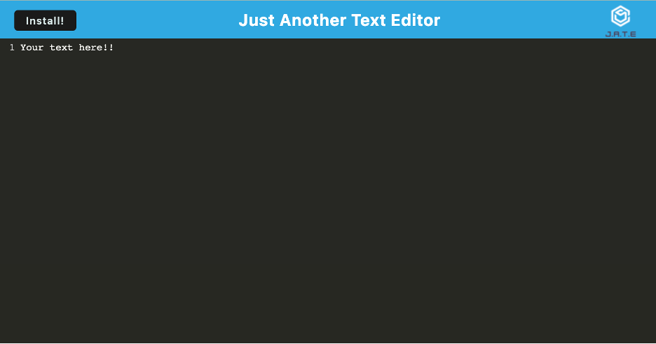

# Caitlin Stevenson|Text Editor Assignment

## Objectives

In this project, I modified key files within the provided PWA and utilized various dev dependencies like webpack and workbox to achieve the end goal of the projectto and create a functioning text editor application.

## Screenshot of Final Page

## Link To The Deployed Page

[Link to final webpage](https://aqueous-retreat-42145.herokuapp.com/)

## Link To GitHub Repo

[Link to GitHub Repo](https://github.com/caitlinscodes/text_editor)

## License

This code is licensed under the MIT License.